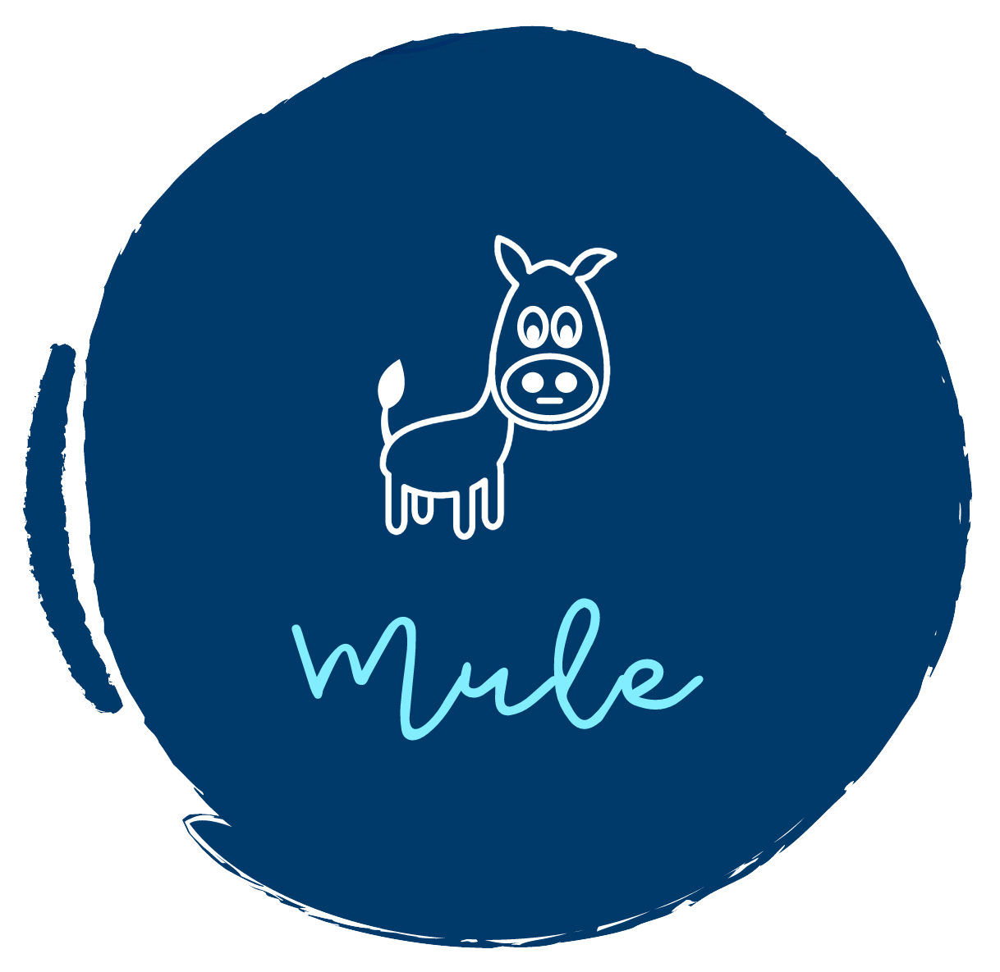

<!-- PROJECT LOGO -->
<br />
<p align="center">
  <a href="https://github.com/whisperingmule/mule-app">
    
  </a>

  <h3 align="center">Mule</h3>

  <p align="center">
    Get delivered on the go.
    <br />
    <a href="https://github.com/whisperingmule/mule-app/blob/master/README.md"><strong>Explore the docs »</strong></a>
    <br />
  </p>
</p>


<!-- TABLE OF CONTENTS -->
## Table of Contents

* [About the Project](#about-the-project)
  * [Built With](#built-with)
* [Getting Started](#getting-started)
  * [Prerequisites](#prerequisites)
  * [Installation](#installation)
* [Roadmap](#roadmap)
* [Contributions](#contributions)
  * [Authors and Acknowledgements](#authors-and-acknowledgements)
* [Dependencies](#dependencies)
  * [Dev Dependencies](#dev-dependencies)
* [Contact](#contact)


<!-- ABOUT THE PROJECT -->
## About The Project

Mule is an intelligent delivery system that enables people to act as delivery units in exchange for incentivized benefits. By offering a peer to peer delivery service, Mule ensures seamless communication across multiple entities.

Through our app we connect our users to “Mules” (Deliverers), who deliver a requested commodity from establishments close to them for an incentive which is chosen by both the mule and the user. Loaded with all the tools necessary to ensure a satisfying consumer experience, Mule has an active payment gateway, a chat portal to stay connected with the mules and a bidding system which ensures both parties can agree on a price.

We hope to create a world where delivery isn’t a hassle but an opportunity, an opportunity for the people to earn as well as leverage the resources they have to the best of their ability.

To better understand our concept, please watch our concept video:

<a href="http://www.youtube.com/watch?feature=player_embedded&v=zdTL0JeCp8Q
" target="_blank"></a>

### Built With
* [Flutter](https://flutter.dev/)
* [NodeJS](https://nodejs.org/en/)
* [MongoDB](https://www.mongodb.com/)
* [Google Cloud Platform](https://cloud.google.com/)
* [Heroku](https://www.heroku.com/)
* [Firebase](https://firebase.google.com/)

<!-- GETTING STARTED -->
## Getting Started

To get a local copy up and running follow these simple steps.

### Prerequisites
* Install an IDE. Our team members use [Visual Studio Code](https://code.visualstudio.com/) or [IntelliJ](https://www.jetbrains.com/idea/)
* [Install Flutter](https://flutter.dev/docs/get-started/install)
* [Set up your editor](https://flutter.dev/docs/get-started/editor?tab=vscode)
* [Test Drive](https://flutter.dev/docs/get-started/test-drive?tab=vscode)

### Installation
1. Clone the repository
```sh
git clone https://github.com/whisperingmule/mule-app.git
```
2. Also clone the [mule-backend](https://github.com/whisperingmule/mule-backend) repository if you will be working on the backend (Optional)
```sh
git clone https://github.com/whisperingmule/mule-backend.git
```
3. Change the directory to the *mule-app* project repository and run the app
```sh
cd path/to/flutter/app
flutter run
```
You need to have a device connected, or a simulator open, for flutter run to work.


<!-- ROADMAP -->
## Roadmap

See the [open issues](https://github.com/whisperingmule/mule-app/issues) for a list of proposed features (and known issues).


<!-- CONTRIBUTIONS AND GITHUB WORKFLOW -->
## Contributions

Contributions are what help us grow abd make us such an amazing place to be learn, inspire, and create. Any contributions you make are **greatly appreciated**.
Please follow the [GitHub Workflow](https://github.com/whisperingmule/mule-app/blob/master/github-workflow.md) while making contributions.

### Authors and Acknowledgements

Our team of developers deserve all the appreciation in the world! Without them, we would not have reached this far.

[Mrigank Doshy](https://github.com/mrigankdoshy) - Co-Founder and Developer\
[Ji Darwish](https://github.com/JiDarwish) - Lead Mobile Application Developer\
[Zohar Cochavi](https://github.com/zoharcochavi) - Mobile Application Developer\
[Tarek Alabd](https://github.com/TarekAlabd) - Mobile Application Developer


<!-- DEPENDENCIES -->
## Dependencies
* [Cupertino Icons](https://pub.dev/packages/cupertino_icons)
* [MobX](https://pub.dev/packages/mobx)
* [Get It](https://pub.dev/packages/get_it)
* [Avatar Glow](https://pub.dev/packages/avatar_glow)
* [Email Validator](https://pub.dev/packages/email_validator)
* [Dio](https://pub.dev/packages/dio)
* [Font Awesome Flutter](https://pub.dev/packages/font_awesome_flutter)
* [Flutter Secure Storage](https://pub.dev/packages/flutter_secure_storage)
* [Google Maps Flutter](https://pub.dev/packages/google_maps_flutter)
* [Sliding Up Panel](https://pub.dev/packages/sliding_up_panel)
* [Geolocator](https://pub.dev/packages/geolocator)
* [Permission Handler](https://pub.dev/packages/permission_handler)
* [Google Maps Web Service](https://pub.dev/packages/google_maps_webservice)
* [Flutter Typeahead](https://pub.dev/packages/flutter_typeahead)
* [Image Picker](https://pub.dev/packages/image_picker)
* [Fluster](https://pub.dev/packages/fluster)
* [Flutter Cache Manager](https://pub.dev/packages/flutter_cache_manager)
* [Flutter Polyline Points](https://pub.dev/packages/flutter_polyline_points)
* [Flutter Progress Button](https://pub.dev/packages/flutter_progress_button)
* [Firebase Messaging](https://pub.dev/packages/firebase_messaging)
* [LatLong](https://pub.dev/packages/latlong)
* [Intl](https://pub.dev/packages/intl)
* [URL Launcher](https://pub.dev/packages/url_launcher)

### Dev Dependencies
* [Build Runner](https://pub.dev/packages/build_runner)
* [MobX Codegen](https://pub.dev/packages/mobx_codegen)

<!-- CONTACT -->
## Contact

Feel free to [Email](mailto:whisperingmule@gmail.com?subject=[GitHub]%20Mule%20App%20Repository) us if you have any questions or feedback!\
You can also visit our [Website](https://whisperingmule.com) for more information.
